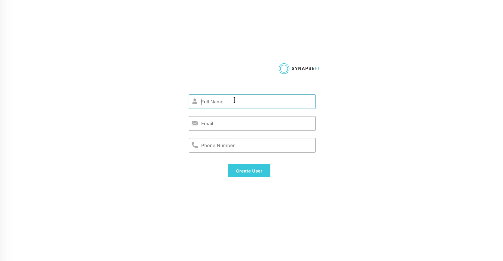
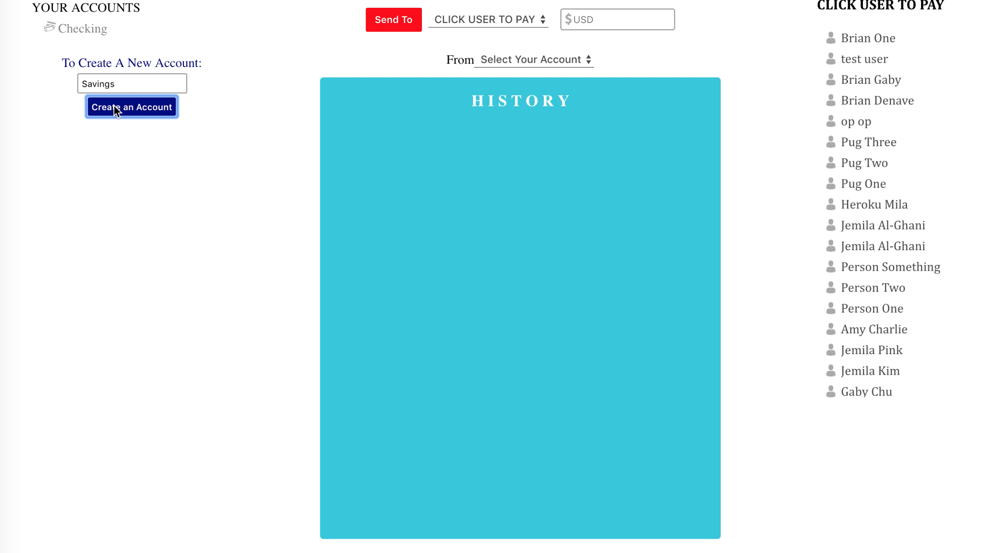
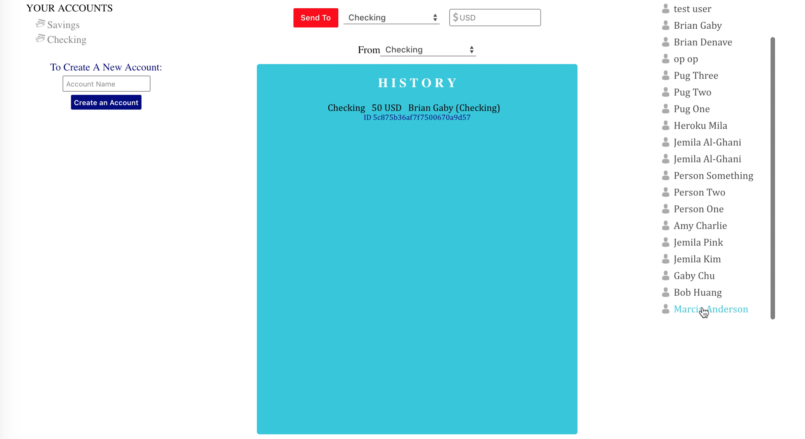

# SynapseFi

Check out the live version [here](https://synapse-dlezzsjjko.now.sh/)

## Using This Web Application

1. fill in Login form with first and last Name, email and a phone number  
   
2. create an account by inputting an account name  
   
3. click on a name under USER TO PAY
4. select an account of the USER TO PAY from the first dropdown
5. input amount of money you wish to pay
6. select from second dropdown one of your accounts to pay from
7. hit send  
   
